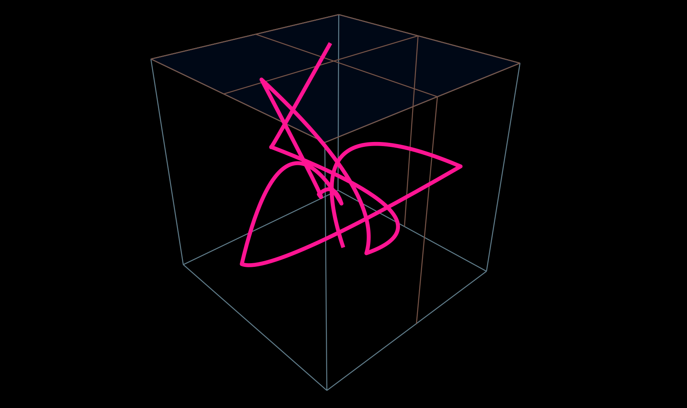

# Bare minimum text marker

A plugin for [bare-minimum-2d](https://www.npmjs.com/package/bare-minimum-2d) for plotting polygons as quadratic bezir curves.


[Demo](https://fuddl.github.io/bare-minimum-quadratic-bezier/)



## How to build the example

```
npm install && npm run build && cd example && npm install && npm run start
```

[font-family]: https://developer.mozilla.org/en-US/docs/Web/SVG/Attribute/font-family
[fill]: https://developer.mozilla.org/en-US/docs/Web/SVG/Attribute/fill
[font-size]: https://developer.mozilla.org/en-US/docs/Web/SVG/Attribute/font-size
